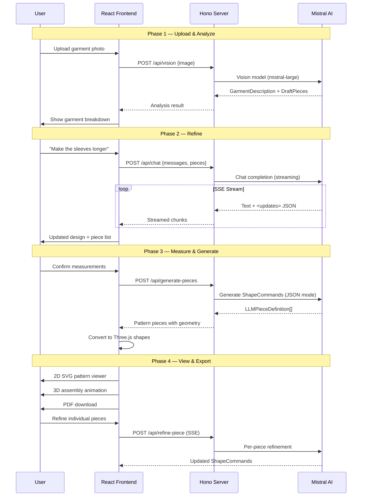

<p align="center">
  
  
  
  
  
</p>

<h1 align="center">Check-Fit</h1>

<p align="center">
  <strong>From Photo to Pattern — AI-powered sewing patterns from a single image.</strong>
</p>

<p align="center">
  Upload a photo of any garment, refine it through conversation, and generate custom sewing patterns fitted to your exact body measurements — complete with 2D pattern viewer, 3D assembly animation, and print-ready PDF export.
</p>

---

## The Problem

Creating sewing patterns from existing garments is a skill that takes years to develop. Hobbyists, cosplayers, and fashion designers spend hours manually drafting patterns, often needing expensive software or professional pattern-making knowledge. There's no easy way to go from "I want to make _that_" to a printable pattern fitted to your body.

## The Solution

**Check-Fit** bridges the gap between inspiration and creation. Point your camera at any garment — a dress, jacket, hoodie, or pair of pants — and our AI pipeline will:

1. **Analyze** the garment's construction, identifying every piece from bodice panels to collar bands
2. **Refine** the design through natural conversation — change sleeve length, add pockets, switch closures
3. **Generate** mathematically precise pattern pieces scaled to your body measurements
4. **Visualize** how pieces assemble in an interactive 3D animation on a dress form
5. **Export** print-ready PDFs with seam allowances, grain lines, and sewing instructions

## How It Works

Check-Fit uses an **agentic AI pipeline** where a multimodal LLM acts as both the garment analyst and the pattern drafter, with the user guiding the process through conversational refinement.

### The Pipeline

```
  Photo Upload ──> Vision Analysis ──> Conversational Refinement ──> Pattern Generation ──> Output
       |                |                       |                          |                  |
   Camera/File    Mistral Vision         Streaming Chat             LLM + Geometry      SVG / 3D / PDF
                  identifies parts       user tweaks design        produces ShapeCommands
```

**Vision Analysis** — The uploaded garment image is sent to Mistral's multimodal model, which returns a structured `GarmentDescription` (category, construction details, closure type) along with an initial list of `DraftPieces` (e.g., "Front Bodice", "Left Sleeve", "Collar Band").

**Conversational Refinement** — Users chat with the AI to modify the design. Want longer sleeves? A different collar? The LLM streams back updated garment descriptions and piece lists in real-time via Server-Sent Events. Voice input is also supported.

**Pattern Generation** — The finalized design + body measurements are sent to the LLM, which generates precise `ShapeCommand` arrays (move, line, curve) for each pattern piece in inches. These are mathematically scaled to the user's measurements.

**Rendering** — Shape commands are converted to Three.js geometries for 3D visualization and SVG paths for the 2D pattern viewer, then composed into tiled PDF layouts for printing.

## Architecture



## Tech Stack

| Layer            | Technology                     | Purpose                              |
| ---------------- | ------------------------------ | ------------------------------------ |
| **Frontend**     | React 19 + Vite 7 + TypeScript | UI framework with fast HMR           |
| **Styling**      | Tailwind CSS v4 + Shadcn UI    | Warm, crafty design system           |
| **3D Engine**    | Three.js + React Three Fiber   | Pattern piece visualization          |
| **3D Animation** | @react-spring/three            | Spring physics assembly animation    |
| **Backend**      | Hono v4 + Bun                  | Lightweight API server               |
| **AI/LLM**       | Mistral AI (mistral-large)     | Vision analysis + pattern generation |
| **PDF**          | jsPDF                          | Print-ready pattern export           |
| **Routing**      | React Router v7                | Multi-step wizard flow               |

## Key Features

### Multimodal Garment Analysis

Upload any garment photo and the vision model identifies the garment category (dress, top, hoodie, jacket, pants, skirt, jumpsuit), individual construction components, closure types, and fit characteristics — all returned as structured JSON.

### Conversational Design Refinement

Don't just accept what the AI suggests — have a conversation. Modify the design through natural language ("add a hood", "make it knee-length", "switch to a zipper closure"). Changes stream back in real-time with updated piece lists.

### Parametric Pattern Generation

The LLM generates `ShapeCommand` arrays — sequences of move, line, and curve operations in inches — that are mathematically scaled to the user's 12 body measurements (bust, waist, hip, shoulder width, arm length, inseam, and more).

### 3D Assembly Animation

The centerpiece demo: watch flat pattern pieces animate with spring physics onto a procedural wireframe mannequin. Orbit, zoom, hover to inspect, click to isolate individual pieces. Cylindrical geometry bending simulates how fabric wraps around the body.

### Per-Piece Refinement

After generation, refine individual pieces through a dedicated chat interface in the pattern viewer. The AI adjusts shape commands while respecting neighboring piece constraints.

### Print-Ready PDF Export

Download tiled PDF layouts with seam allowances, piece labels, grain direction, cut counts, fold indicators, and step-by-step sewing instructions — ready for home printing.

### Voice Input

Speak your refinements hands-free. Audio is transcribed via Mistral and fed into the chat pipeline, keeping your hands on the fabric.

## Project Structure

```
check-fit/
├── src/                              # React frontend
│   ├── components/
│   │   ├── three/                    # 3D components
│   │   │   ├── PatternAssembly.tsx   #   Canvas + scene setup
│   │   │   ├── PatternPiece3D.tsx    #   Animated piece with bending
│   │   │   └── DressForm.tsx         #   Procedural mannequin
│   │   └── ui/                       # Shadcn components
│   ├── pages/
│   │   ├── wizard/                   # Multi-step creation flow
│   │   │   ├── UploadStep.tsx        #   Photo upload / template select
│   │   │   ├── AnalyzeStep.tsx       #   Vision model analysis
│   │   │   ├── RefineStep.tsx        #   Chat-based refinement
│   │   │   ├── MeasurementsStep.tsx  #   Body measurement input
│   │   │   └── GenerateStep.tsx      #   Pattern generation
│   │   ├── PatternViewerPage.tsx     # 2D SVG viewer + per-piece chat
│   │   ├── AssemblyPage.tsx          # 3D assembly demo
│   │   └── InstructionsPage.tsx      # Sewing guide
│   ├── context/
│   │   └── PatternContext.tsx        # Global state (pieces, measurements, chat)
│   ├── lib/
│   │   ├── api.ts                    # API client (SSE streaming)
│   │   ├── llm-to-pattern.ts         # ShapeCommands → Three.js shapes
│   │   ├── generators/               # Piece-type generators (bodice, sleeve, etc.)
│   │   └── pdf/                      # PDF export pipeline
│   └── types/                        # TypeScript interfaces
│
├── server/                           # Hono backend
│   └── src/
│       ├── index.ts                  # App setup + CORS
│       ├── lib/mistral.ts            # Mistral client init
│       └── routes/
│           ├── vision.ts             # POST /api/vision
│           ├── chat.ts               # POST /api/chat (SSE)
│           ├── generate-pieces.ts    # POST /api/generate-pieces
│           ├── refine-piece.ts       # POST /api/refine-piece (SSE)
│           ├── transcribe.ts         # POST /api/transcribe
│           └── tts.ts                # POST /api/tts
│
└── package.json
```

## Getting Started

### Prerequisites

- [Bun](https://bun.sh/) runtime
- [Mistral AI API key](https://console.mistral.ai/)

### Setup

```bash
# Clone the repo
git clone https://github.com/your-org/check-fit.git
cd check-fit

# Install dependencies
bun install
cd server && bun install && cd ..

# Configure environment
echo "MISTRAL_API_KEY=your_key_here" > server/.env

# Start both frontend and backend
bun run dev:all
```

The app will be available at `http://localhost:5173` with the API server on port `3001`.

### Commands

| Command              | Description                   |
| -------------------- | ----------------------------- |
| `bun run dev`        | Start Vite dev server         |
| `bun run dev:server` | Start Hono backend            |
| `bun run dev:all`    | Run both concurrently         |
| `bun run build`      | Type-check + production build |
| `bun run lint`       | ESLint                        |

## API Endpoints

| Endpoint               | Method | Description                               |
| ---------------------- | ------ | ----------------------------------------- |
| `/api/vision`          | POST   | Analyze garment image via multimodal LLM  |
| `/api/chat`            | POST   | Conversational refinement (SSE streaming) |
| `/api/generate-pieces` | POST   | Generate pattern piece ShapeCommands      |
| `/api/refine-piece`    | POST   | Refine individual piece (SSE streaming)   |
| `/api/transcribe`      | POST   | Audio-to-text transcription               |
| `/api/tts`             | POST   | Text-to-speech synthesis                  |
| `/api/health`          | GET    | Health check                              |

## Future Extensibility

- **Body measurement extraction from photos** — Computer vision pipeline to auto-extract measurements from a full-body photo
- **Fabric simulation** — Physics-based drape simulation to preview how different fabrics behave on the pattern
- **Pattern library** — Save, share, and remix patterns in a community marketplace
- **Multi-size grading** — Automatically grade patterns across a size range (XS–3XL)
- **Seam matching validation** — Verify that adjacent pieces have compatible edge lengths before export
- **Import/Export standards** — Support for industry-standard formats (DXF, PLT) for professional cutting machines
- **AR try-on** — Augmented reality preview of the finished garment on the user's body

## Built With

Built in 24 hours for the Mistral Worldwide Hackathon by leveraging Mistral AI's multimodal capabilities, Three.js for immersive visualization, and a conversational UX that makes pattern drafting accessible to everyone.

---

<p align="center">
  <sub>Check-Fit — Because every body deserves a perfect fit.</sub>
</p>
